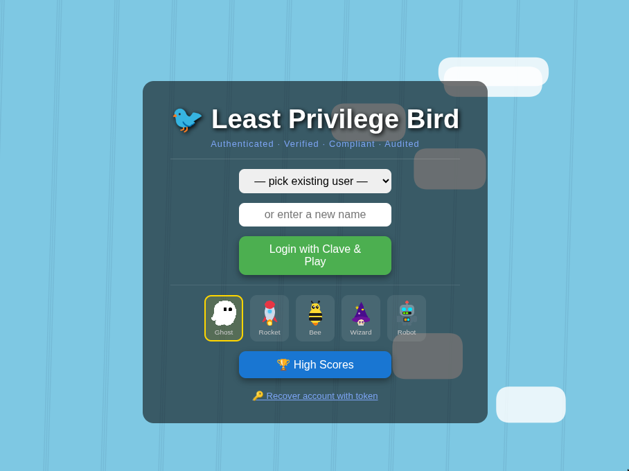

# Least Privilege Bird

Flappy Bird, wrapped in AWS IAM bureaucracy. Before you may flap, you must survive
fake SSO, an IAM policy-evaluation review, educational captchas (real AWS knowledge
checks), and STS token generation. The friction *is* the feature.

Built for an AWS workshop, now a (cursed) internal fun tool. Vanilla JS, no build step.

**▶ Play: https://snowu.github.io/least-privlege-bird/**

## Stack

- **Frontend** — vanilla JS + HTML5 Canvas, deployed on GitHub Pages. No bundler.
- **Backend** — Supabase (Postgres + Edge Functions) for the leaderboard.

## Layout

- `index.html` — entry point, sets the `DEV_MODE` / `LIVE_DB` flags.
- `game.js` — the game: fixed-timestep loop, seeded PRNG, records run inputs.
- `clave.js` — the IAM/SSO/captcha satire layer ("Clave" auth theater).
- `scores.js` — token storage + Supabase calls (leaderboard read, score submit).
- `supabase/` — Edge Function (`submit-score`), authoritative sim, deploy + architecture docs.
- `assets/` — sprites and audio. `img/` — screenshots.

## Leaderboard is server-authoritative

Scores are **never trusted from the client**. On death the browser sends the run's
*inputs* `{seed, flapTicks}`; a Supabase Edge Function re-simulates the game server-side
and stores only a score it independently reproduces. A forged number is rejected.

See [`supabase/ARCHITECTURE.md`](supabase/ARCHITECTURE.md) for the full flow + diagrams,
and [`supabase/README.md`](supabase/README.md) to deploy.

## Your account token

There are no passwords. When you first claim a name, the game generates a **secret token**
and shows it to you once — that token *is* your account. It's saved in your browser's
localStorage and proves you own the name when you submit a score.

**Save it somewhere.** You'll need it if your localStorage gets wiped (clearing browser
data, incognito) or you want to play under the same name on another machine.

To restore: hit **"🔑 Recover account with token"** (or the **"Recover session"** link on
the token screen) and paste it. Your browser is bound to that name again and your high
scores carry over. Lose the token with no copy saved and the name is effectively locked —
pick a new one.
