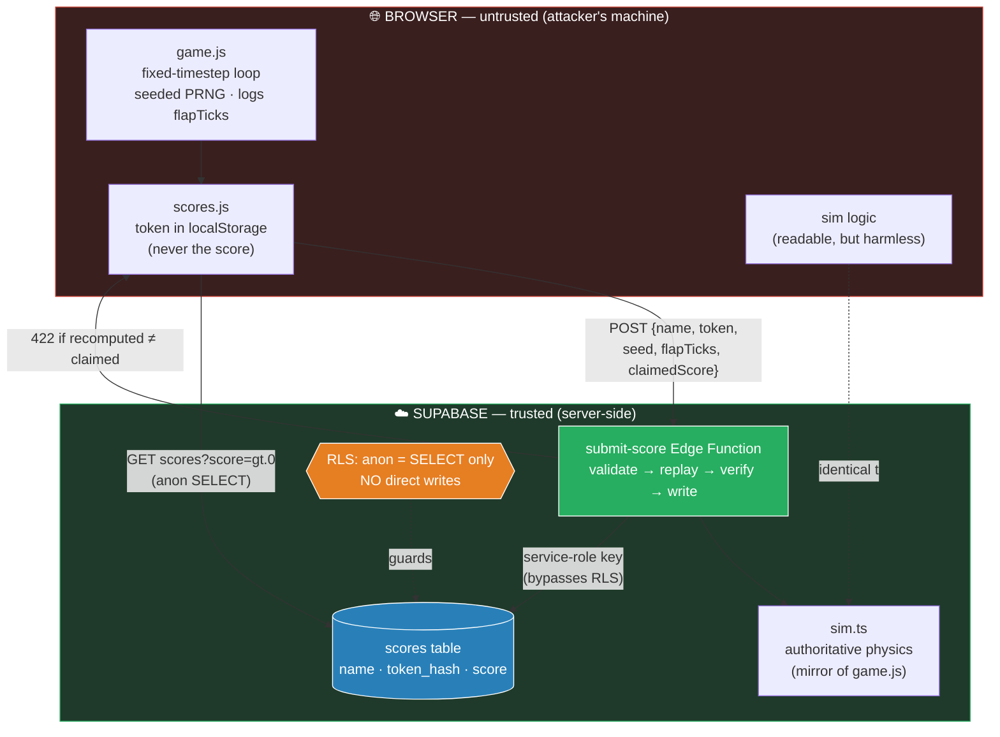
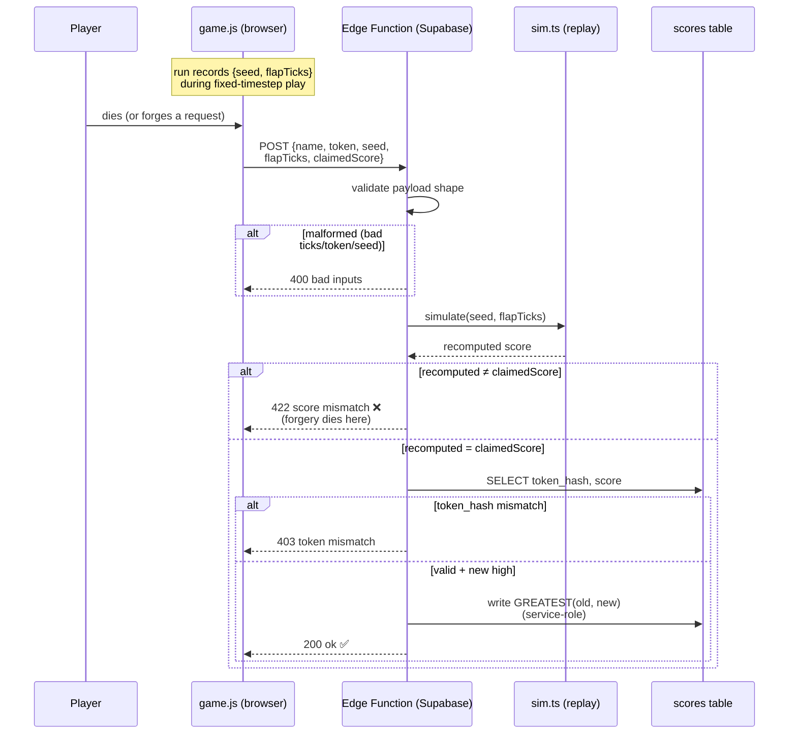
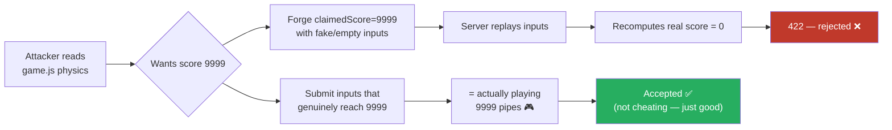

# Anti-cheat architecture & flow

The leaderboard is **server-authoritative**. The browser is the attacker's machine and
cannot be trusted, so a claimed score is never stored as-is — the client sends the
*inputs* of the run, and a Supabase Edge Function re-simulates the game server-side and
stores only a score it independently reproduces.

## The whole flow

1. **Registration** — On a new name (when `LIVE_DB` is on), the client generates a
   48-hex token, stores it in localStorage (**token only, never the score**), shows the
   token modal, and POSTs an empty run `{seed, flapTicks:[], claimedScore:0}` to the edge
   function. This registers the row at score 0 — the account is real the moment the token
   exists.
2. **Gameplay (deterministic)** — `initGame` picks a random `seed`, seeds the mulberry32
   PRNG, resets `flapTicks=[]`. The loop is fixed-timestep: physics advance in 1/60s ticks
   via an accumulator, independent of monitor refresh rate. Pipe heights come from the
   seeded PRNG. Every flap is logged as the tick number it occurred on. The whole run is
   reproducible from `{seed, flapTicks}` alone.
3. **Death → submit** — Client captures `{seed, flapTicks}` (before `initGame` wipes them)
   and POSTs `{name, token, seed, flapTicks, claimedScore}` to the edge function.
4. **Edge function (server-side)** — Validates payload shape → **replays** via `sim.ts`
   → if `recomputed !== claimedScore` rejects (`422`) → token-hash verify → max-only write
   with the service-role key (bypasses RLS).
5. **Leaderboard read** — Client reads `scores` directly (anon SELECT), filtered
   `score > 0`.

## The four security locks

Break any one and it leaks; all four hold:

1. **RLS** — anon can't write `scores` directly → can't skip the function.
2. **Server-side code** — the function runs on Supabase, not the browser → logic
   unalterable.
3. **Replay** — claimed score is recomputed from inputs → a forged number is rejected.
4. **Service-role secrecy** — the write key lives only in the function's env → an
   attacker can't impersonate the function.

---

## Architecture

---

## Submit sequence (the anti-cheat moment)

---

## Why reading the client's sim doesn't help an attacker

**Knowing the rules ≠ being able to fake the inputs.** The claimed number is worthless
because the server recomputes it; the only inputs that yield score N are inputs that
legitimately survive N pipes.

> Remaining caveat (out of scope): a bot that programmatically plays well produces
> *valid* inputs — that's "being good at the game," not forging. Defending against it
> needs behavioral/timing heuristics.
